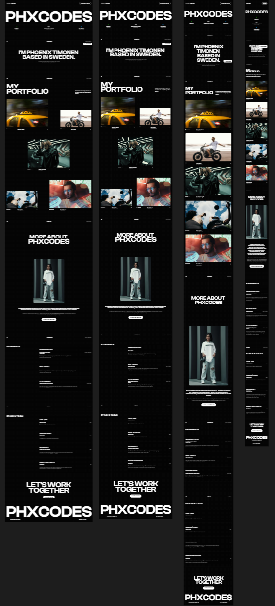
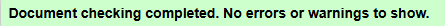
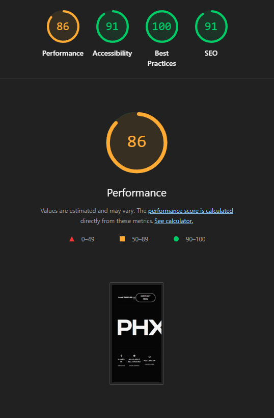

# PHXCODES Portfolio (Skolprojekt)

Denna portfolio är utvecklad som ett skolprojekt i kursen [HTML/CSS] och visar en responsiv webbplats byggd med fokus på ren HTML5, CSS3 och Vanilla JavaScript.

## 🛠️ Tekniska Specifikationer

* **HTML:** Semantisk HTML5-struktur med fokus på tillgänglighet.
* **CSS:** CSS3 (Custom Styling) och responsiv design via Media Queries.
* **JavaScript:** Vanilla JS för Fullskärmsmeny, Modal-hantering och lokal tid.

* Gjorde designen via en figma template!
* 

## ✅ Uppfyllda Krav (Kvalitetsbevis)

Alla obligatoriska kvalitets- och tillgänglighetskrav har uppfyllts.

### 1. W3C HTML-validering
Koden är fri från syntaxfel och följer strikt HTML5-standard. Små fel (URL-kodning, XHTML-syntax) har åtgärdats.

### 2. Lighthouse Tillgänglighet (Accessibility)
Webbplatsen testades med Chrome Lighthouse för att säkerställa hög tillgänglighet (WCAG 2.1).

| Mätvärde | Poäng (Desktop) | Kommentar |
| :--- | :--- | :--- |
| **Accessibility** | **99%** | Uppnåddes genom att justera kontrast, fokusstyling (`:focus-visible`) och se till att tryckmål är tillräckligt stora på mobil. |

---
**Kontakt:** [phoenix.timonen@medieinstitutet.se]
